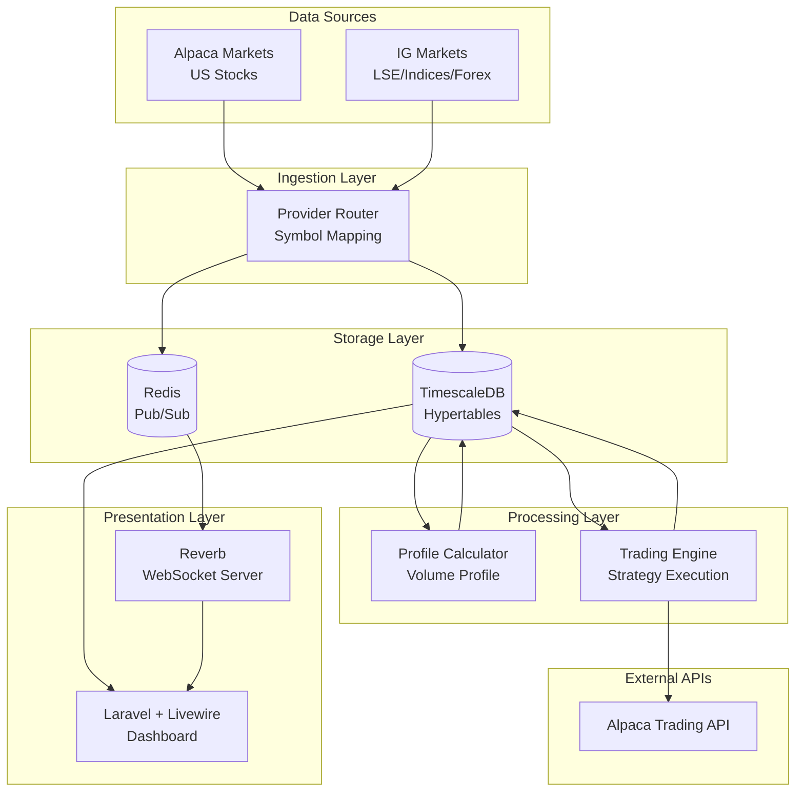

# Trading Platform Architecture

**Last Updated**: 2025-10-02

## System Overview



## Service Architecture

### 1. Ingestion Service (Python)
**Location**: `services/ingestion/`

**Responsibilities**:
- Multi-provider data ingestion
- Real-time WebSocket connections
- Symbol-to-provider routing
- Data normalization and storage

**Providers**:
- `AlpacaWSProvider` - US stocks via Alpaca WebSocket
- `IGProvider` - LSE/indices/forex via IG Markets API
- `DemoProvider` - Synthetic data for testing

**Key Components**:
- `ProviderRouter` - Routes symbols to correct provider
- `main.py` - Orchestrates data ingestion
- `db.py` - Database connection and storage

### 2. Profile Calculator (Python)
**Location**: `services/profile_calculator/`

**Responsibilities**:
- Volume profile calculation (POC, VAH, VAL, LVNs)
- Order flow metrics (CVD, buy/sell pressure)
- Runs every 60 seconds

**Outputs**:
- `volume_profile` table
- `profile_metrics` table
- `order_flow` table

### 3. Trading Engine (Python)
**Location**: `services/engine/`

**Responsibilities**:
- Strategy execution (Auction Market Theory)
- Market state detection (BALANCE/IMBALANCE)
- Aggressive flow analysis
- Position management via Alpaca API
- Database-backed strategy configuration

**Key Components**:
- `StrategyManager` - Loads config from database
- `AutoStrategy` - Auction Market implementation
- `AlpacaClient` - Trading API integration
- `PositionManager` - Risk management

### 4. Laravel Web Application (PHP)
**Location**: `web/`

**Responsibilities**:
- User interface and dashboard
- Real-time data visualization
- Strategy management UI
- Account and portfolio tracking

**Architecture**:
- **Services**: `MarketDataService`, `TradingMetricsService`, `AccountService`
- **Components**: `Watchlist`, `StockDetail`, `StrategyManager`
- **Views**: Blade templates with Livewire
- **Real-time**: Laravel Reverb WebSocket integration

## Data Flow

### Real-Time Market Data
```
Market Data (Alpaca/IG)
  ↓ WebSocket
Provider Router
  ↓ Normalize
TimescaleDB (candles, ticks)
  ↓ Redis Pub/Sub
Reverb WebSocket
  ↓ Broadcast
Browser (Live Chart Updates)
```

### Strategy Execution
```
Trading Engine (every 60s)
  ↓ Query
TimescaleDB (candles, volume_profile, order_flow)
  ↓ Analyze
Market State Detection
  ↓ Evaluate
Strategy Rules (from strategy_configs)
  ↓ Decision
Alpaca API (place order)
  ↓ Store
TimescaleDB (signals)
```

### Strategy Management
```
User (Strategies UI)
  ↓ Toggle/Adjust
Laravel (StrategyManager)
  ↓ Update
TimescaleDB (strategy_configs)
  ↓ Read (every 60s)
Trading Engine
  ↓ Apply
Strategy Execution
```

## Database Schema

### Core Tables (PostgreSQL + TimescaleDB)

**Hypertables** (time-series optimized):
- `candles` - OHLCV bars (partitioned by time)
- `ticks` - Raw trades (compressed after 1 day)
- `volume_profile` - Volume by price level
- `order_flow` - Buy/sell pressure metrics
- `market_state` - BALANCE/IMBALANCE states

**Regular Tables**:
- `symbols` - Trading symbols with provider mapping
- `strategies` - Strategy definitions
- `strategy_configs` - Per-symbol strategy settings
- `signals` - Trading signals (BUY/SELL)

### Key Indexes
- `idx_candles_symbol_time` - Fast symbol queries
- `idx_volume_profile_symbol` - Volume profile lookups
- `idx_order_flow_symbol` - Order flow queries

## Technology Stack

### Backend Services
- **Python 3.11** - Ingestion, processing, trading
- **FastAPI-style** - Async/await patterns
- **Loguru** - Structured logging
- **psycopg2** - PostgreSQL driver

### Web Application
- **Laravel 11** - PHP framework
- **Livewire 3** - Reactive components
- **TailwindCSS** - Styling
- **TradingView Lightweight Charts** - Financial charts

### Infrastructure
- **PostgreSQL 15** - Database
- **TimescaleDB 2.13** - Time-series extension
- **Redis 7** - Pub/sub and caching
- **Docker Compose** - Container orchestration
- **Laravel Reverb** - WebSocket server

## Deployment Architecture

### Containerized Services (Docker)
- `db` - PostgreSQL + TimescaleDB
- `redis` - Redis server
- `ingestion` - Python ingestion service
- `profile_calculator` - Python profile calculator
- `engine` - Python trading engine
- `reverb` - Laravel Reverb WebSocket server
- `relay` - Redis to Reverb bridge

### Local Service
- `Laravel` - Runs locally on port 8002 (not containerized for easier development)

## Scalability Considerations

### Current Capacity
- **Symbols**: 44 configured, can scale to 1000+
- **Data Rate**: ~30 updates/second (real-time)
- **Storage**: ~100 MB/month per symbol (compressed)
- **Latency**: <100ms (market data → browser)

### Future Scaling
- **Horizontal**: Add more ingestion workers per provider
- **Vertical**: Increase TimescaleDB resources
- **Caching**: Redis caching layer for frequently accessed data
- **CDN**: Static assets via CDN
- **Load Balancing**: Multiple Laravel instances

## Security

### API Keys
- Stored in `.env` files (not committed)
- Separate keys for paper/live trading
- Provider-specific credentials

### Database
- Connection pooling
- Prepared statements (SQL injection prevention)
- Row-level security (future)

### Web Application
- Laravel authentication
- CSRF protection
- XSS prevention
- Rate limiting

## Monitoring & Logging

### Logs
- **Ingestion**: `docker compose logs ingestion`
- **Engine**: `docker compose logs engine`
- **Profile**: `docker compose logs profile_calculator`
- **Laravel**: `web/storage/logs/laravel.log`

### Metrics (Future)
- Prometheus for metrics collection
- Grafana for visualization
- Alert manager for notifications

## Development Workflow

### Local Development
```bash
# Start backend services
docker compose up -d

# Run Laravel locally
cd web && php artisan serve --port=8002

# Watch logs
docker compose logs -f
```

### Testing
```bash
# Unit tests
cd web && php artisan test

# Integration tests (future)
pytest services/engine/tests/
```

### Deployment
```bash
# Pull latest code
git pull

# Restart services
docker compose restart

# Clear Laravel caches
cd web && php artisan optimize:clear
```

## Notes

- **Timezone Strategy**: All data stored in UTC, displayed in ET
- **Provider Abstraction**: Easy to add new providers (just implement base interface)
- **Strategy Flexibility**: Database-backed config allows runtime changes
- **Code Quality**: Service-oriented architecture, 81% size reduction from refactoring
- **Real-time Updates**: WebSocket streaming for live chart updates
- **Multi-Provider Ready**: IG Markets integration pending account unlock
