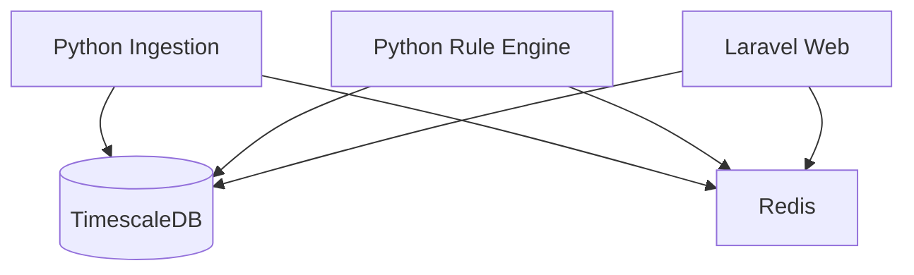

# Architecture

## Containers

## Notes
- Timescale hypertables for `candles` and `signals`.
- Providers are pluggable via simple class interface (`services/ingestion/app/providers/`).
- Rule engine consumes Redis streams or pub/sub (future), queries history from DB, emits signals.
- Laravel reads from DB and Redis for real-time dashboard.
